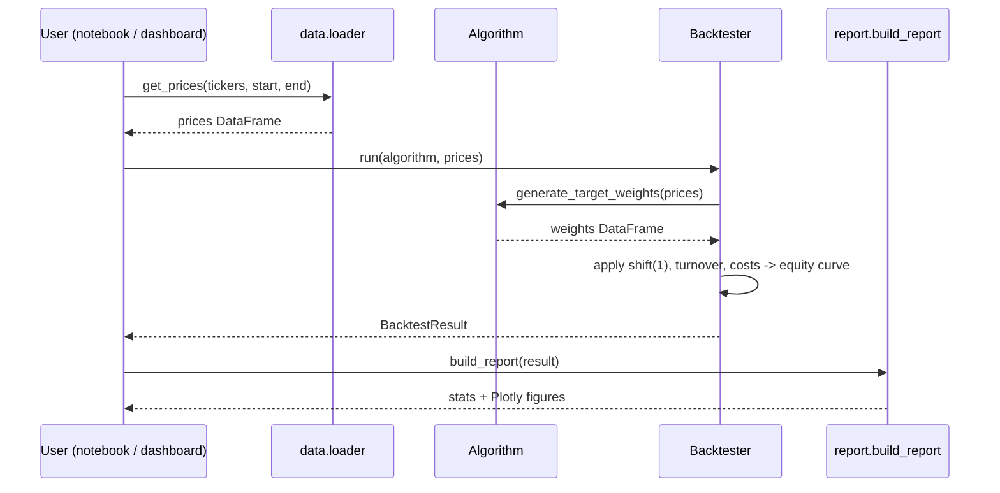
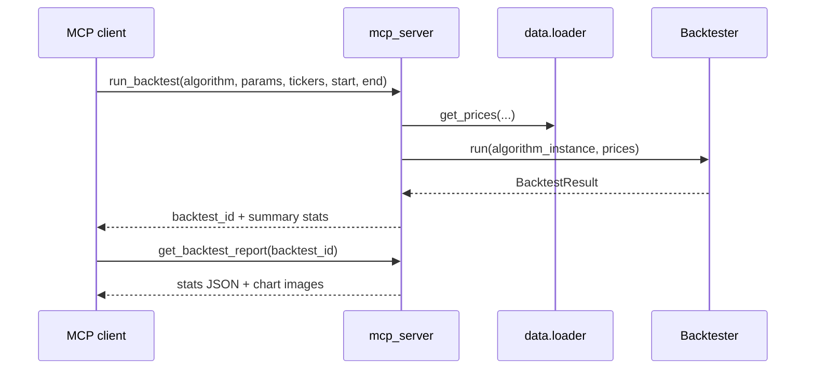

# pyTrader — Design & Implementation Plan

## 1. Goals

- Lightweight backtesting system for US equities, with a few built-in strategies.
- One simple interface so built-in *and* user-written strategies backtest the same way.
- Solid performance stats, plus both static (notebook) and interactive (dashboard) visualizations.
- An MCP server that's a thin wrapper over the same core code — no separate logic path.
- An architecture that won't need a rewrite when live execution (Robinhood) is added later.

**Not doing now**: live trading, intraday/options/futures data, non-US markets, a database, auth. Local files + Python only. Keep the core small enough that one person can hold the whole data flow in their head: prices in, target weights out, weights simulated into an equity curve.

---

## 2. Core abstraction: the `Algorithm` class

Every strategy — MA crossover, pairs trading, portfolio rebalancing, or a user's own — implements one method:

```python
class Algorithm(ABC):
    def generate_target_weights(self, prices: pd.DataFrame) -> pd.DataFrame:
        ...
```

**Input** — `prices`: a DataFrame indexed by trading date (ascending), one column per ticker, values are adjusted close price. No gaps or NaNs — the data loader guarantees a clean matrix over the requested range.

**Output** — a DataFrame with the *same date index* as the input, columns being the tickers the strategy wants exposure to. Each value is the target fraction of portfolio equity to hold in that ticker on that date, in `[-1, 1]` (negative = short). For any date, `sum(abs(weights))` should be `<= 1` (no implicit leverage). Before a strategy has enough history to produce a real signal (e.g. during a moving-average warm-up), it should output `0`, not `NaN`.

That's the whole contract. The strategy never touches order execution, fills, or costs — it only decides *what it wants to hold*, and the backtester turns that into an equity curve. Concretely, MA crossover looks like:

```python
class MovingAverageCrossover(Algorithm):
    def __init__(self, ticker, short_window=20, long_window=100):
        self.ticker, self.short_window, self.long_window = ticker, short_window, long_window

    def generate_target_weights(self, prices):
        short_ma = prices[self.ticker].rolling(self.short_window).mean()
        long_ma = prices[self.ticker].rolling(self.long_window).mean()
        weight = (short_ma > long_ma).astype(float)          # 1.0 or 0.0
        return weight.to_frame(self.ticker).reindex(prices.index).fillna(0.0)
```

A user copies this pattern, swaps in their own logic, and passes an instance straight to `Backtester.run(...)` — no registration step required.

---

## 3. Repository layout

```
pyTrader/
  algorithm/           # Algorithm base class + built-in strategies
  data/                # price loader + local cache
  backtest/            # engine, metrics, plotly-based report
  dashboard/           # interactive Dash app
  mcp_server/          # thin MCP tool wrappers
  notebook/            # example notebooks
  tests/
  doc/design.md        # this file
```

Roughly 700–1000 lines of source for the whole MVP. No database, no web framework beyond Dash for the dashboard.

---

## 4. Data layer (`data/loader.py`)

One function: `get_prices(tickers, start, end) -> pd.DataFrame` of adjusted close prices.

- Source: `yfinance` (free, no key, daily bars are enough for this use case) — kept behind this one function so it can be swapped later without touching anything else.
- Local parquet cache under `data/cache/`; only missing date ranges are re-fetched.
- Fails loudly if a ticker can't be downloaded or has excessive gaps, rather than silently dropping it or filling with guesses.

---

## 5. Built-in algorithms (`algorithm/`)

- **`MovingAverageCrossover`** — single stock. Long when short MA > long MA, flat (or short, if enabled) otherwise.
- **`PairsTrading`** — two stocks. Rolling hedge ratio (simple OLS via `numpy.polyfit`), spread = A − ratio·B, z-score of the spread. Long-A/short-B below `-entry_z`, short-A/long-B above `+entry_z`, flatten inside `exit_z`.
- **`PortfolioRebalance`** — N stocks. User-specified target weights, re-applied on a fixed schedule (monthly/quarterly); drifts naturally between rebalances since the engine carries yesterday's weight forward via returns.

Each is small (well under 100 lines) and depends only on pandas/numpy.

---

## 6. Backtest engine (`backtest/engine.py`)

A vectorized, deterministic daily-bar simulator — not an order/fill simulator:

```python
weights = algorithm.generate_target_weights(prices)
gross_returns = (weights.shift(1) * prices.pct_change()).sum(axis=1)   # shift(1): no look-ahead
turnover = weights.diff().abs().sum(axis=1)
net_returns = gross_returns - turnover * (commission_bps + slippage_bps) / 1e4
equity = initial_capital * (1 + net_returns).cumprod()
```

The `shift(1)` is structural, not a convention strategies have to remember — it's the engine's job to prevent look-ahead bias. Costs default to zero for reproducibility, and can be turned on for realism. The engine raises a clear error if weights violate the leverage cap or contain NaNs where price data exists, rather than quietly producing a wrong curve. Everything downstream (metrics, report, MCP, dashboard) reads from a single `BacktestResult` object holding the equity curve, returns, and weight history.

---

## 7. Metrics & visualization (`backtest/metrics.py`, `backtest/report.py`)

**Metrics**: total return, CAGR, annualized volatility, Sharpe, Sortino, max drawdown, Calmar ratio, win rate, trade count, and optional benchmark comparison (default SPY).

**Charts**, built with **Plotly** (not matplotlib) so the exact same figures render in notebooks, the dashboard, and can be exported as static images/JSON for the MCP server:
- Equity curve vs. benchmark
- Drawdown chart
- Price chart with buy/sell markers (single-stock strategies)
- Spread & z-score chart with entry/exit lines (pairs trading)
- Stacked-area weights over time (portfolio rebalancing)

One function, `build_report(result) -> Report`, produces the stats dict + figure list that every consumer (notebook, dashboard, MCP) shares.

---

## 8. Interactive dashboard (`dashboard/`)

A small **Dash** app (Plotly's) as a local web UI over the same core: pick an algorithm, tickers, date range, and parameters from simple form controls, click "Run", and see the `Report` figures render interactively (zoom, hover, toggle series). It calls `Backtester.run()` and `build_report()` directly — no new backtest logic lives in the dashboard, only layout and callbacks. This is what makes Plotly the right chart library: one figure implementation serves notebooks, the dashboard, and (as static exports) the MCP server.

**Running it**: like any Dash app, it's just a Python script that starts a local dev server —

```bash
python -m dashboard.app
```

This prints a local URL (Dash's default is `http://127.0.0.1:8050`); open that in a browser. No separate server process, container, or deployment step needed for local use — the `if __name__ == "__main__": app.run(debug=True)` block at the bottom of `dashboard/app.py` is the entire "launch mechanism."

---

## 9. MCP server (`mcp_server/`)

Thin tool wrappers, no business logic:
- `list_algorithms()` — built-in names + parameter schema.
- `run_backtest(algorithm, params, tickers, start, end, initial_capital, commission_bps)` — runs `Backtester`, returns a `backtest_id` + summary stats.
- `get_backtest_report(backtest_id)` — stats JSON + chart images for a prior run.
- `get_current_signal(algorithm, params, tickers)` — today's target weights only, no simulation. This is the seam a future live/Robinhood integration would call before placing orders.

**Forward-compat note**: adding live execution later means writing a `broker/robinhood.py` that implements `get_positions` / `get_cash` / `place_order`, driven by `get_current_signal`'s output. `algorithm/` and `backtest/` shouldn't need to change — this is why the target-weight interface stays pure and side-effect-free now.

---

## 10. Safety & correctness

- No look-ahead bias: enforced in the engine (`shift(1)`), not left to each strategy.
- No execution capability anywhere in this phase — MCP server only reads data and simulates. Any future live broker adapter must require explicit opt-in, not be reachable by default.
- Fail loudly on bad data or leverage-violating weights instead of silently clipping/filling.
- API keys/secrets (future data or broker providers) go in a gitignored `.env`, never committed.
- Deterministic-by-default math (zero costs unless set) so results are reproducible and comparable across strategy variants.
- Tests: each algorithm's signal logic on small synthetic price series with hand-checkable expected output, plus one engine test with a toy example whose equity curve is computed by hand.

---

## 11. Notebooks (`notebook/`)

Same pattern each time — load data, instantiate algorithm, run backtest, print stats, show charts — so they double as living API docs:

1. `01_ma_crossover.ipynb`
2. `02_pairs_trading.ipynb`
3. `03_portfolio_rebalance.ipynb`
4. `04_custom_algorithm.ipynb` — subclassing `Algorithm` from scratch

---

## 12. Sequence diagrams

**Running a backtest** (used identically by notebooks and the dashboard):



**MCP server request**:



---

## 13. Implementation phases

1. Scaffolding — `pyproject.toml`, dependencies (`pandas`, `numpy`, `yfinance`, `plotly`, `dash`, `pydantic`, `mcp`), `.gitignore` for cache/`.env`.
2. Data layer — `data/loader.py` with parquet caching.
3. Core types + `Algorithm` base class.
4. Built-in algorithms — MA crossover, pairs trading, portfolio rebalance.
5. Backtest engine + metrics, with unit tests.
6. Reporting — `backtest/report.py` (Plotly figures).
7. Dashboard — `dashboard/app.py`.
8. Notebooks.
9. MCP server.
10. *(Future)* live broker adapter (Robinhood), implementing the same signal seam.

Each phase only adds files; later phases don't change the interfaces set in phases 2–5.
